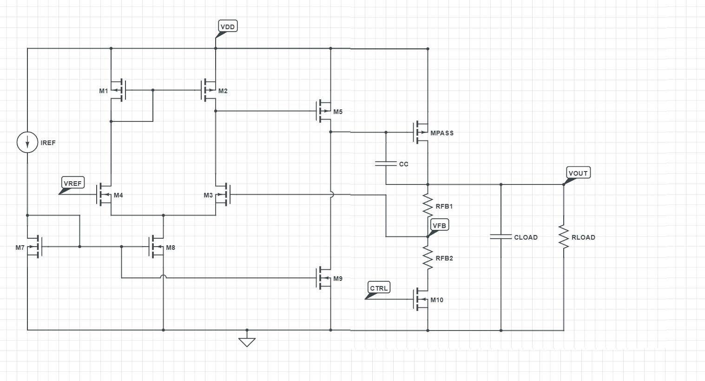

# Design of an Adjustable Low Drop-out Regulator
3 Week hands on [Cloud Based Analog IC Design Hackathon](https://www.iith.ac.in/events/2022/02/15/Cloud-Based-Analog-IC-Design-Hackathon/) conducted by Electrical Engineering Department of IIT Hyderabad inassociation with VLSI System Design (VSD) Corp. Pvt. Ltd India and sponsored by Synopsys India.
The Hackathon provided an oppurtunity to implement proposed LDO design using Synopsis Custom Compiler on 28nm CMOS Technology. The below repository is the final submission for completion of Adjustable LDO design

## Table of Contents
1. [Abstract](#abstract)
2. [Working](#working)
3. [Reference Circuit](#reference-circuit)
4. [Tools Used](#tools-used)
5. [Implementation](#implementation)
6. [Schematic Netlist](#schematic-netlist)
7. [Simulation result](#simulation-result)
8. [Challenge](#challenge)
9. [Limitations](#limitations)
10. [References](#references)
11. [Acknowledgements](#acknowledgements)
12. [Author](#author)

## Abstract
Low Drop-out regulator (LDO) is a linear voltage regulator designed to provide stable DC voltage. To satisfy evolving on chip power delivery requirements, a CMOS LDO capable of providing two adjustable voltage levels by using a binary-input control signal is implemented. It supplies a 0.6V default output voltage from a 1.0V battery input and a maximum load of 20mA.

## Working
Linear regulators convert one voltage level to a lower voltage level by dissipating the excess energy as waste heat in the output device. The pass element gate voltage is controlled to regulate the output voltage at a stable state. 
A high gain OPAMP is used as error amplifier, with a stable voltage reference at one input and feedback voltage is connected to the other input of the differential amplifier. A current mirror is used to bias the error amplifier with current IREF.
In order to achieve high gain a second stage common source amplifier is used. In order to keep the LDO stable miller compensation is used. Miller compensation is used to split the poles and bring the second pole below UGB and achieve better stability.
 NMOS acts as a strong pull down device, yielding rail-to-rail swing. Operational amplifiers with rail-to-rail output stage achieve the maximum output signal swing in systems with low single-supply voltages. They are capable of generating an output signal up to the supply rails.
 

	 
	<h5 align="center">Figure 1: Top level schematic</h5>

## Reference Circuit

	 
	<h5 align="center">Figure 2: Proposed reference schematic</h5>

## Tools Used
- Synopsys Custom Compiler: Custom Compiler provides a highly productive environment for design entry
and simulation, with strong features for mixed-signal design, debug, simulation
management, analysis, and reporting. 
- Synopsys Primewave: The PrimeWave Design Environment is a comprehensive environment for all Synopsys simulation engines and analysis capabilities.It provides an easy-to-use simulation setup cockpit, support for grid-based job distribution and monitoring of simulation jobs, and a powerful graphical waveform viewer. Whether designing analog, mixed-signal, or RF designs on mature or advanced nodes,
PrimeWave is a unified solution for all applications. 
- Synopsys 28nm PDK: LDO is designed using Synopsys 28nm PDK.

## Implementation

**1. Sizing the Pass Element:**
- The pass element is designed to carry the full load of 20mA at all PVT corners.
- The device is designed to operate in saturation region.
- PMOS is used as pass element. The pass element is sized for  Max load current, Minimum VDD, Minimum tolerable Vg and SS corner at-40 Deg C.
- Inorder to ensure that Pass element isnt over sized, It is ensured to have leakage current less than the maximun current allowed across resistor divider circuit. Pass element is tested at FF corner at  85Deg C.
- PMOS Element is designed to operate at -40 to 85 deg C.
  

	 
	<h5 align="center">Figure 3: ID across Pass Element at SS Testbench</h5>

  

	 
	<h5 align="center">Figure 4:ID across Pass Element at SS result</h5>

  

	 
	<h5 align="center">Figure 5: Leakage across Pass Element at FF Testbench</h5>

  

	 
	<h5 align="center">Figure 6: Leakage across Pass Element at FF result</h5>

